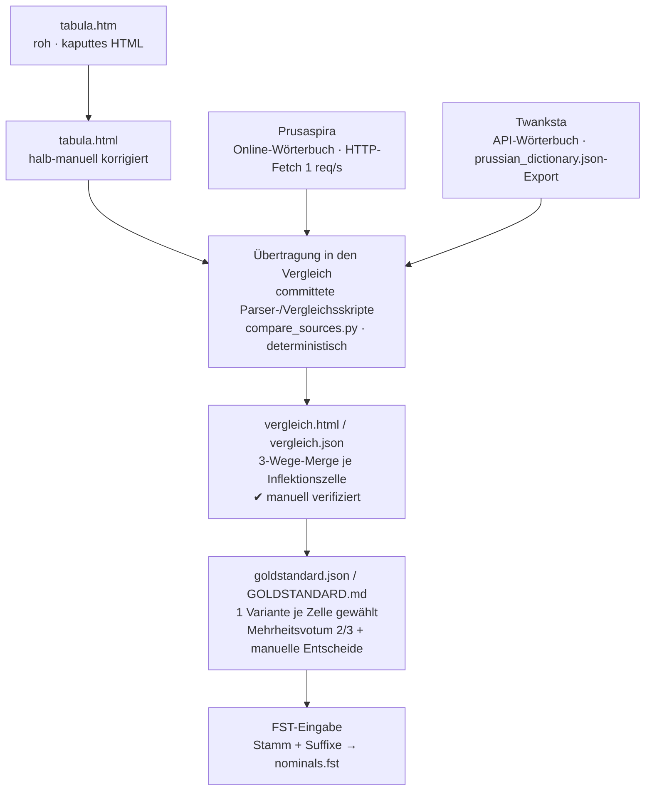

# Data Provenance

Herkunft und Vertrauenskette der altpreußischen Flexionsdaten: von den drei
Quellen über den manuell verifizierten 3-Wege-Vergleich bis zum `goldstandard`,
der als FST-Eingabe dient.

## Quellen

| Quelle | URL | Abruf / Methode | Roh-Format |
|--------|-----|-----------------|------------|
| **Tabula Nova** | `donelaitis.vdu.lt/prussian/tabula.htm` (Spiegel `prusaspira.org`) | Manuell gepflegte HTML-Referenztabelle aller Paradigmen (Nr. 1–144). Das kaputte Roh-HTML (`tabula.htm`) wurde **halb-manuell korrigiert** → `tabula.html`. | `tabula.htm` → `tabula.html` |
| **Prusaspira** | `prusaspira.org/wirdeins?…&bila=1&wirds=‹lemma›` | Online-Wörterbuch mit voller Flexionstabelle je Lemma; **HTTP-Fetch** pro Lemma, 1 req/s, englische Oberfläche. | `prusaspira/{n}_{lemma}.{html,txt}` |
| **Twanksta** | `wirdeins.twanksta.org/search/?dia=semba&s=‹lemma›` | API-gestütztes Wörterbuch; **API-Abfrage** gegen den `prussian_dictionary.json`-Export. | `twanksta/{n}_{lemma}/lemma.json` |

## Schritte

**Übertragung.** Die Daten der drei Quellen werden durch **committete, wieder
ausführbare Parser-/Vergleichsskripte** (`src/prussian/compare/compare_sources.py`)
in ein gemeinsames Vergleichsformat überführt; jeder Wert in `vergleich.json`
stammt ausschließlich aus diesen Skripten (deterministisch reproduzierbar). Ein
LLM hat beim **Schreiben dieses Codes** assistiert — nicht an den Datenwerten
oder linguistischen Entscheidungen mitgewirkt. Einzige manuelle Vorstufe:
`tabula.htm` wurde von seinen HTML-Fehlern halb-manuell bereinigt
(→ `tabula.html`), bevor der Parser greift.

**Zusammenführung & Verifikation.** Die drei Quellen werden je Inflektionszelle
gegenübergestellt: `vergleich.html` (farbcodiert für Review) und `vergleich.json`
(rohe geparste Formen pro Quelle). Die Abweichungen wurden **manuell gesichtet und
verifiziert**.

**Goldstandard-Entscheidung.** Aus dem Vergleich wird je Zelle **eine** kanonische
Variante gewählt: **Mehrheitsvotum (2 von 3)** *nach* einer orthographischen
Normalisierungsschicht; echte, dadurch nicht aufgelöste Konflikte per **manueller
Einzelentscheidung**. Ergebnis: `goldstandard.json` (FST-Eingabe: Stamm + Suffixe)
und `GOLDSTANDARD.md` (Review-Tabelle).

## Beleglage

Von 69 Lemmata: 54 exakte Dictionary-Treffer, 4 per API ergänzt, 1 per Fuzzy-Suche,
5 manuell gemappt, 5 ohne Eintrag.

## Status

Die manuelle Verifikation ist laufend. **Offen:** `wesselingis` wurde im
`vergleich` übersehen und steht für einen erneuten Durchgang an.
